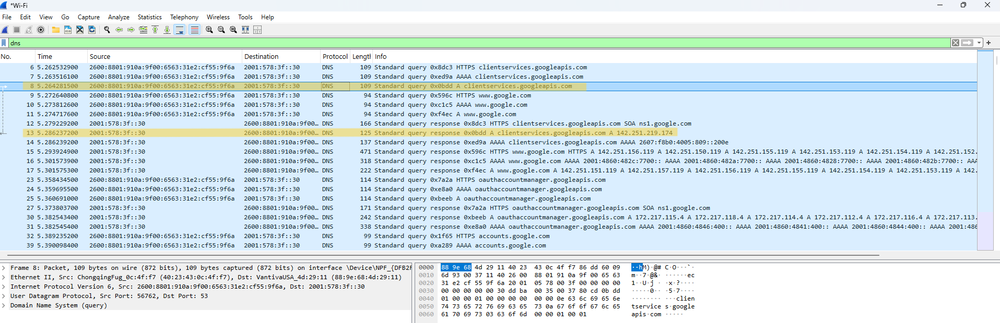

# Wireshark Home Lab: DNS Traffic Analysis

## Objective

Capture and analyze DNS traffic using Wireshark to understand how a computer resolves a domain name into an IP address.

## Environment

- Windows 11
- Wireshark
- Wi-Fi connection

## Scenario

I captured network traffic while browsing the web to observe how my computer communicates with a DNS server.

## Investigation

During the packet capture, I identified both DNS queries and DNS responses.

The computer sent a DNS query requesting the IPv4 address (A record) for `clientservices.googleapis.com`.

The DNS server successfully responded with the IPv4 address `142.251.219.174`

The capture also showed an AAAA query, which requests the IPv6 address for the same domain.

Because the DNS server returned a valid IPv4 address, the DNS lookup completed successfully. This indicates that DNS was functioning correctly and was not the cause of any connectivity issue during this capture.

## Analysis

- The computer requested the IPv4 address for `clientservices.googleapis.com` using a DNS A record query.
- The DNS server returned the IPv4 address `142.251.219.174`, confirming successful DNS resolution.
- The packet capture also included an AAAA query requesting the IPv6 address for the same domain.
- The successful DNS responses indicate that DNS was functioning correctly during this capture.

## Key Concepts

- DNS translates domain names into IP addresses.
- A records return IPv4 addresses.
- AAAA records return IPv6 addresses.
- A DNS query requests information from a DNS server.
- A DNS response returns the requested information.

## What I Learned

This lab helped me understand how DNS translates domain names into IP addresses and how to analyze DNS traffic using Wireshark. I learned how to identify DNS queries and responses, distinguish between A and AAAA records, and determine whether DNS resolution completed successfully.

## Skills Demonstrated

- Wireshark packet analysis
- DNS troubleshooting
- Identifying A and AAAA records
- Basic network traffic analysis

## Evidence

*Figure 1: Wireshark capture showing a DNS query (Packet 8) and the matching DNS response (Packet 13). The DNS server returned the IPv4 address `142.251.219.174`, confirming successful DNS resolution.*
