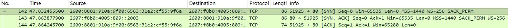

# Wireshark Home Lab: TCP Three-Way Handshake

## Objective

Learn how TCP establishes a reliable network connection by capturing and analyzing the TCP three-way handshake using Wireshark.

---

## Environment

- Windows 11
- Wireshark
- Web Browser
- Internet Connection

---

## Scenario

A packet capture was performed while accessing an HTTP website. The objective was to identify the TCP three-way handshake and understand how TCP establishes a reliable connection before application data is exchanged.

---

## Investigation

A packet capture was performed while browsing to an HTTP website.

The capture contained multiple TCP connections because modern web pages establish several connections simultaneously to load different resources.

To focus on a single conversation, the TCP stream containing the observed three-way handshake was isolated using the following Wireshark display filter:

```text
tcp.stream == 5
```

Filtering by the TCP stream removed unrelated network traffic and displayed only the packets associated with that single TCP connection. This made it easier to analyze the complete three-way handshake.

The first three packets of the TCP stream showed the complete three-way handshake:

1. SYN
2. SYN, ACK
3. ACK

After the handshake completed, the browser transmitted an HTTP GET request to retrieve data from the web server.

---

## Analysis

The TCP three-way handshake establishes a reliable connection between the client and server before any application data is exchanged. This process confirms that both systems are ready to communicate and helps ensure reliable data transmission.

The observed packets were:

- **SYN** – The client requested to establish a connection with the server.
- **SYN, ACK** – The server acknowledged the client's request and indicated it was ready to communicate.
- **ACK** – The client confirmed receipt of the server's response.

Each handshake packet contained `Len=0`, indicating that no application payload was transmitted while the connection was being established.

Once the handshake completed, the client transmitted an HTTP GET request to begin exchanging application data.

This demonstrates that TCP first establishes a reliable transport connection before higher-layer protocols such as HTTP begin exchanging data.

This capture also demonstrated TCP communication over IPv6, showing that the TCP handshake operates the same regardless of whether IPv4 or IPv6 is used.

---

## Key Concepts

- TCP
- TCP Three-Way Handshake
- SYN
- SYN-ACK
- ACK
- Source Port
- Destination Port
- HTTP
- Port 80
- IPv6

---

## What I Learned

This lab helped me understand how TCP creates a reliable connection before any application data is exchanged.

I learned that:

- TCP uses a three-way handshake consisting of SYN, SYN-ACK, and ACK.
- Handshake packets contain no application payload (`Len=0`).
- HTTP requests are transmitted only after the TCP connection has been established.
- TCP behaves the same whether it operates over IPv4 or IPv6.

---

## Skills Demonstrated

- Packet Capture
- Wireshark Display Filters
- TCP Stream Analysis
- Network Traffic Analysis
- Protocol Analysis
- Basic Network Troubleshooting

---

## Evidence



The screenshot below shows the TCP conversation after filtering with `tcp.stream == 5`, highlighting the SYN, SYN-ACK, and ACK packets that establish the TCP connection.

- Packet 1: SYN
- Packet 2: SYN, ACK
- Packet 3: ACK

---

## Reflection

Before completing this lab, I understood that TCP used a three-way handshake, but I did not fully understand the purpose of each packet or how the handshake appeared in real network traffic.

Capturing the handshake in Wireshark helped me see that TCP establishes a reliable connection before any application data is transmitted. Observing the transition from the handshake to the HTTP GET request made it much easier to understand how web communication begins.

This lab reinforced the importance of following network evidence rather than making assumptions when troubleshooting connectivity issues.

Understanding the TCP three-way handshake provides a strong foundation for future network analysis and will help me investigate connection failures, identify abnormal network behavior, and better understand packet captures during security investigations.
