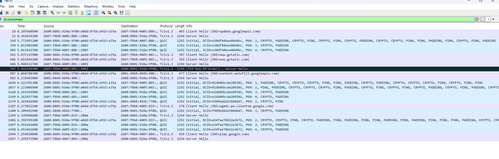
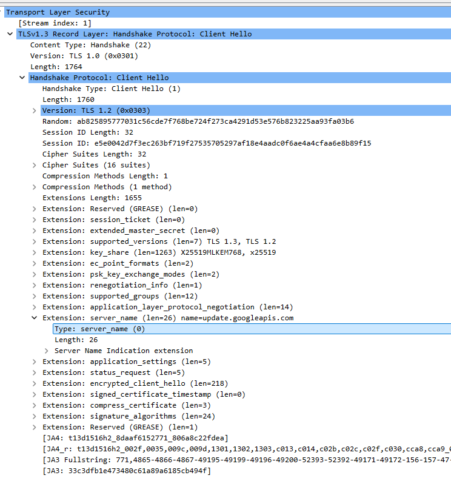

# Wireshark Home Lab: TLS Handshake Analysis

## Objective

Learn how TLS establishes an encrypted connection by capturing and analyzing the TLS handshake using Wireshark.

---

## Environment

- Windows 11
- Wireshark
- Google Chrome
- Internet Connection

---

## Scenario

A packet capture was performed while generating HTTPS traffic using Google Chrome. The objective was to identify the TLS handshake and understand how a client and server negotiate encryption before securely exchanging application data.

---

## Investigation

A packet capture was started using the active Wi-Fi interface in Wireshark.

After beginning the capture, HTTPS traffic was generated by browsing to several Google services.

To isolate the TLS handshake packets, the following Wireshark display filter was applied:

```text
tls.handshake
```

This filter displayed only the TLS handshake packets and removed most unrelated network traffic.

The first handshake identified in the capture showed a connection to:

```text
update.googleapis.com
```

The Client Hello packet was examined first.

The Client Hello packet was examined to identify the security capabilities advertised by the client.

The packet included:

- Supported TLS versions
- Supported cipher suites
- Session ID
- Server Name Indication (SNI)
- Key-share information
- Application-Layer Protocol Negotiation (ALPN)
- Additional TLS extensions

The following TLS versions were advertised by the client:

```text
TLS 1.3
TLS 1.2
```

The Server Name Indication (SNI) identified the destination host as:

```text
update.googleapis.com
```

The Server Hello packet was then analyzed.

The server selected:

```text
TLS 1.3
```

The negotiated cipher suite was:

```text
TLS_AES_256_GCM_SHA384
```

The negotiated key-share group was:

```text
X25519MLKEM768
```

After the handshake completed, the remaining packets were displayed as encrypted TLS Application Data.

---

## Analysis

TLS establishes an encrypted connection before application data is exchanged between a client and server.

The Client Hello is the first message sent during the TLS handshake. It advertises the encryption capabilities supported by the client, including supported TLS versions, cipher suites, cryptographic groups, and protocol extensions.

The Server Name Indication (SNI) extension identified the requested hostname as `update.googleapis.com`. This allows multiple secure websites or services hosted on the same server to present the correct certificate.

The client advertised support for both TLS 1.3 and TLS 1.2.

The Server Hello selected TLS 1.3 as the negotiated protocol version.

The selected cipher suite was:

```text
TLS_AES_256_GCM_SHA384
```

This cipher suite consists of:

- **AES-256** – Symmetric encryption algorithm used to encrypt application data.
- **GCM (Galois/Counter Mode)** – Provides both encryption and integrity protection.
- **SHA-384** – Used during key derivation and cryptographic verification.

The server also selected the following hybrid key-exchange group:

```text
X25519MLKEM768
```

This combines:

- X25519 elliptic-curve cryptography
- ML-KEM-768 post-quantum cryptography

The client and server use this information to generate shared session keys without transmitting the encryption keys across the network.

Once the TLS handshake completed, all application traffic became encrypted and appeared as TLS Application Data within Wireshark.

Although the TLS Record Layer displayed legacy compatibility values, the `supported_versions` extension confirmed that TLS 1.3 was successfully negotiated.

---

## Key Concepts

- TLS
- TLS Handshake
- HTTPS
- Client Hello
- Server Hello
- Server Name Indication (SNI)
- Cipher Suite
- AES-256
- GCM
- SHA-384
- TLS 1.3
- Key Exchange
- X25519
- ML-KEM-768
- Symmetric Encryption
- Public Key Cryptography
- Port 443

---

## What I Learned

This lab helped me understand how TLS negotiates an encrypted HTTPS connection before application data is transmitted.

I learned that:

- The Client Hello initiates the TLS handshake.
- The client advertises supported TLS versions and cipher suites.
- Server Name Indication identifies the requested hostname.
- The server selects the highest mutually supported TLS version.
- The server selects a single cipher suite from those offered by the client.
- The negotiated cipher suite was `TLS_AES_256_GCM_SHA384`.
- The negotiated TLS version was TLS 1.3.
- Key exchange information is used to derive shared session keys.
- Application data is encrypted after the TLS handshake completes.

---

## Skills Demonstrated

- Packet Capture
- Wireshark Display Filters
- TLS Handshake Analysis
- HTTPS Traffic Analysis
- Protocol Analysis
- Cipher Suite Identification
- Network Traffic Analysis
- Basic Network Troubleshooting

---

## Evidence

The screenshot below shows the TLS handshake packets after applying the `tls.handshake` display filter.



The screenshot below shows the Client Hello packet.



The screenshot below shows the Client Hello extensions, including the supported TLS versions and Server Name Indication.


---

## Reflection

Before completing this lab, I understood that HTTPS encrypted web traffic, but I did not fully understand how the encryption was negotiated between a client and server.

Capturing the TLS handshake in Wireshark allowed me to observe how a secure HTTPS connection is negotiated before encrypted application data is exchanged. I identified the Client Hello and Server Hello packets, examined the supported TLS versions, located the Server Name Indication, and identified the cipher suite and key-exchange method selected by the server.

I also learned that modern browsers and servers use TLS 1.3 with strong encryption such as AES-256-GCM and may use hybrid post-quantum key exchanges like X25519MLKEM768.

This lab reinforced the importance of understanding protocol negotiations when troubleshooting secure network communications.

Understanding the TLS handshake provides a strong foundation for analyzing HTTPS traffic, troubleshooting encrypted connections, and performing network investigations in cybersecurity and IT support environments.
````
